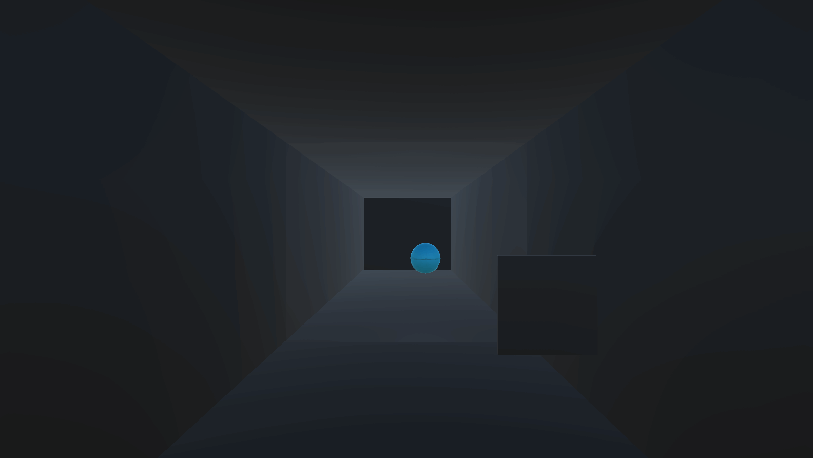

# Pong3D
 
First day Pong movement update
- added Pong ball physics movement
- added Player Movement
- added player ability to push the ball with cooldown
- added UI for ability
- built basic structure of pong using cubes and spheres, lights

 

Second day Pong update
- added Restart, Game End state
- added Score system and its UI
- made material change effect on wall hit
- added player eyes to the player
- fixed few physics movement of pong ball
- added end state UI 

Pong Preview 1

Pong Preview 2

Pong Preview 3

Pong Preview 4

