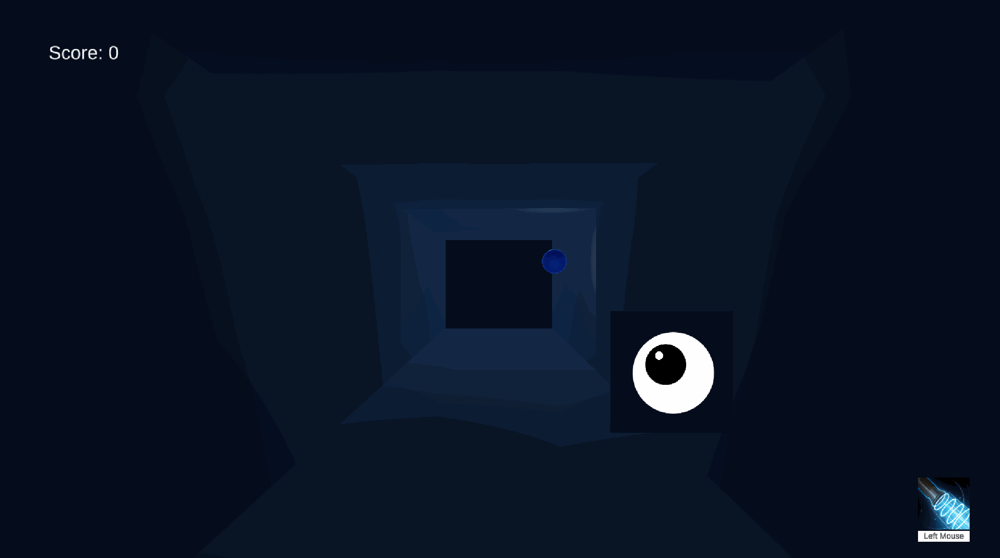

# Pong3D
## Basic Keys
WASD Keys - Movement
Left Mouse Click - Shoot Ball Ability
R key - Restart Game when Game Ends
ESC key - Exit game window

### First day Pong movement update
- added Pong ball physics movement
- added Player Movement
- added player ability to push the ball with cooldown
- added UI for ability
- built basic structure of pong using cubes and spheres, lights

 

### Second day Pong update
- added Restart, Game End state
- added Score system and its UI
- made material change effect on wall hit
- added player eyes to the player
- fixed few physics movement of pong ball
- added end state UI 

Pong Play 1

Pong Play 2

Pong Play 3

Pong Play 4

Pong Game End/ Restart

### Third day 
- cleaned up code 
- added exit game window 

## Itch.io 
[https://littlerookey.itch.io/pong-3d](https://littlerookey.itch.io/pong-3d)

